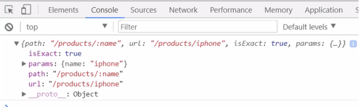

### Router trong ReactJs

#### 1. React-Router là gì?

- SPA (single page application) hiện nay được coi là một xu thế để xây dựng một trang web bởi nhiều tính năng ưu việt
- Khi một trang web được xây dựng theo hướng SPA thì tất cả các UI của trang web sẽ được render ra một trang duy nhất, tùy vào từng trường hợp mà component sẽ được render.
- Trong ReactJS, React Router là thư viện được xây dựng để thực hiện điều đó
- React-Router là một thư viện định tuyến (routing) tiêu chuẩn trong React.
- Cài đặt

```angular2svg
npm install react-router-dom --save
```

#### 2. Các thành phần trong React-Router

##### 2.1 BrowserRouter vs HashRouter

- `React-Router` cung cấp cho chúng 2 thành phần hay sử dụng đó là `BrowserRouter & HashRouter`.
    + `BrowserRouter`: Được sử dụng phổ biến hơn, nó sử dụng History API có trong HTML5 để theo dõi lịch sử bộ định tuyến
    + `HashRouter`: Sử dụng hash của URL (window.location.hash) để ghi nhớ mọi thứ.
    
- Sử dụng trong dự án

```angular2svg
import { BrowserRouter as Router, Route, Link, NavLink } from "react-router-dom";
```

##### 2.2 Route

- Route: Định nghĩa một ánh xạ (mapping) giữa một URL và một Component. 
- Khi người dùng truy cập theo một URL trên trình duyệt, một Component tương ứng sẽ được render trên giao diện.

```angular2svg
<Router>
    <div className="App">
        <Route path="/" exact component={Home} />
        <Route path="/about" component={About} />
        <Route path="/contact" component={Contact} />
        <Route component={NotFound}/>
    </div>
</Router>
```

Trong đó:

- `path`: Là đường dẫn trên URL.
- `exact`: Giúp cho route này này chỉ hoạt động nếu URL trên trình duyệt phù hợp tuyệt đối với giá trị của thuộc tính path của nó.
- `component`: Là component sẽ đươc load ra tương ứng với Route đó.

##### 2.3 Link

- Trong HTML thì cặp thẻ để chuyển hướng đó là thẻ <a></a> thì trong react chúng ta sẽ dử dụng cặp thẻ <Link></Link> được import từ React-Router.

```angular2svg
<Link to="/about">About</Link>
```

Trong đó:
- `to`: Giống như thuộc tính href trong thẻ a.

##### 2.4 NavLink

- NavLink thì rất giống với Link về cách sử dụng
- NavLink tốt hơn vì nó hỗ trợ thêm một số thuộc tính như là `activeClassName` và `activeStyle`
- 2 thuộc tính này giúp cho chúng ta có thể style cho thẻ.

##### 2.5 Custom Link

- Giả sử khi ta không muốn activeClassName hoặc activeStyle tại thẻ NavLink mà nó lại nằm ở một thẻ bao nó
- Ví dụ như thẻ div hay thẻ li ? 

```angular2svg
const MenuLink = ({
    label, // nội dung trong thẻ
    to, // giống như href trong thẻ a
    activeOnlyWhenExact
}) => {
    return (
        <Route 
            path={to}
            exact={activeOnlyWhenExact}
            children={ ({ match }) => { //match la doi tuong xac dinh su trung khop cua URL
                var active = match ? 'active abc' : '';

                return (
                    <li className={`my-li ${active}`}>
                        <Link  to={to} className="my-link">{label}</Link>
                    </li>
                );
            }}
        />
    );
}
```

##### 2.6 Đối tượng Match

- Khi muốn lấy một số thông tin ở trên URL thì ta có thể dùng đối tượng match để lấy dữ liệu về.
- Tại cấu hình Router ta chỉ cần truyền thêm đối tượng match vào component mà cần sử dụng đối tượng match

```angular2svg
{
        path : '/products',
        exact : false,
        main : ({match}) => <Products match={match} />
}
```

Khi console.log(match) ta sẽ có kết quả như sau.


Trong đối tượng params sẽ chứa các tham số mà ta truyền trên URL.

##### 2.7 Đối tượng prompt - Xác nhận trước khi chuyển trang

- Giả sử khi đang nhập liệu ở form nào đó mà không may click nút back hay chuyển trang thì dữ liệu nhập sẽ mất hết
- Để khác phục điều đó ta có đối tượng prompt nó sẽ giúp chúng ta trước khi back hay chuyển trang nó sẽ xác nhận xem là chúng ta có chắc chắn muốn back hay chuyển trang không
- Khi muốn sử dụng đối tượng prompt thì chúng ta chỉ cần import nó từ react-router

```angular2svg
import {Prompt} from 'react-router-dom';

<Prompt 
    when={true} // true | false
    message={ (location) => (`Ban chac chan muon di den ${location.pathname}`) }
/>
```

##### 2.8 Redirect

- Chức năng dùng để chuyển trang.
- Có thể truy xuất thông tin trang trước đó thông qua đối tượng location. 
- Để sử dụng Redirect ta chỉ cần import nó từ react-router.

```angular2svg
import { Redirect } from 'react-router-dom';
```

- Khi muốn sử dụng location thì tại cấu hình Router ta chỉ cần truyền thêm đối tượng location vào component mà cần sử dụng nó.

```angular2svg
{
    path : '/login',
    exact : false,
    main : ({location}) => <Login location={location} />
}
```
